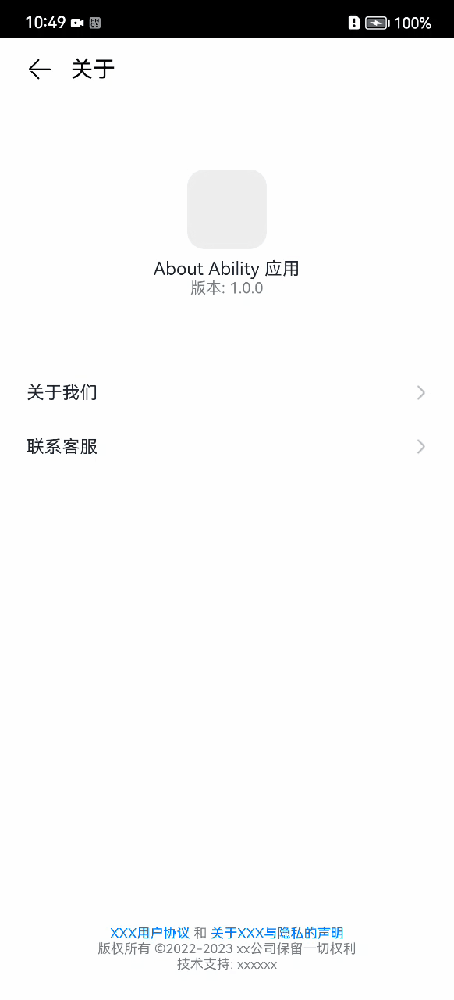

## AboutSample
### 简介
本示例展示了一般应用关于页面，包含了应用图标信息，联系客服和关于我们入口，用户协议和隐私声明入口，效果图如下：   

### 相关概念
无。

### 相关权限
不涉及。

### 使用说明
1.点击列表中的关于我们跳转到关于我们页面，开发者可修改该页面展示的信息；  
2.点击列表中的联系客服跳转到联系客服页面，开发者可修改该页面展示的信息；  
3.页面中部列表开发者可修改配置；  
4.点击下方的用户协议跳转到协议页面，该页面用web组件加载rawfile下的html资源文件，开发者可修改该html文件；  
5.点击下方的隐私声明跳转到隐私声明页面，该页面用web组件加载rawfile下的html资源文件，开发者可修改该html文件；

## 约束与限制
1、本示例支持API9及以上的标准系统上运行。  
2、本示例支持SDK版本和DevEco Studio版本：  
SDK：3.2.1.4 Canary1及以上。
DevEco Studio版本： DevEco Studio Beta4(Build Version: 3.1.0.100, build on November 3, 2022)及以上。