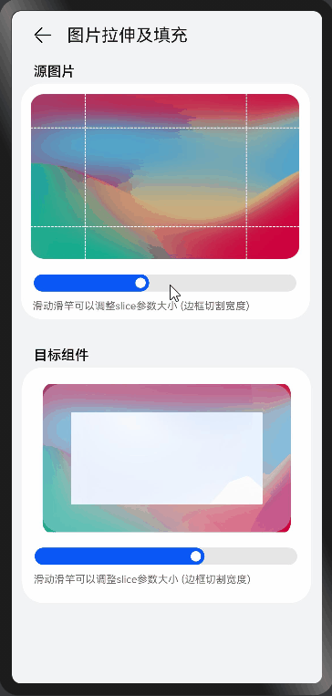
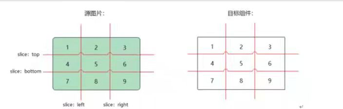

# borderImage
### 简介
本示例介绍了常用组件的borderImage属性，动态调整slice和width的值，可以看到目标图片边框里的图片有伸缩和宽高变化效果，效果图如下：

### 相关概念
borderImage属性为组件提供了通过图片和渐变色填充边框的能力。  

borderImage中传入的是BorderImageOption类型参数，BorderImageOption中如下属性。

source：设置目标组件边框的源图片或者渐变色。

slice：设置显示出目标组件边框中填充的内容和切割比例，详细解释如下：

    将源图片、目标组件分别以九宫格划分，borderImage属性的功能就是分别把源图片中的1-9分别填充到目标组件的1-9区域。
    
    对于源图片的区域1，宽度是slice参数的left，高度是slice参数的top。
    
    对于源图片的区域3，宽度是图片的宽度减去slice参数的right，高度是slice参数的top。
    
    对于源图片的区域4，宽度是slice参数的left，高度是slice参数bottom减去slice参数的top。

width：设置目标组件边框的宽度，例如效果图中将目标组件的滑动条从图左的位置滑动到图右的位置，目标组件中边框的宽度有图左的组件宽度变成图右的组件宽度。

outset：设置组件的边框超出组件本身的距离，可以分别对上下左右的边框设置不同的值。

repeat：组件边框图片的重复方式，有RepeatMode.Repeat、RepeatMode.Stretch、RepeatMode.Round、RepeatMode.Space四种重复类型，对2/4/6/8区域生效，1/3/7/9四个角仅能拉伸填充。

fill：参数为布尔类型，对于中心区域5，如果fill为true，则源图的区域5会填充到目标组件5的位置，fill为false则不填充。

### 相关权限
不涉及

### 使用说明

1.左右滑动源图片中的滑动条，改变borderImage属性的slice的值，包括上下左右四条边slice的值，可以使目标组件中边框中的图片同步伸缩。

2.左右滑动目标组件的滑动条，改变borderImage属性的width的值，包括上下左右四条边的width的值，可以使目标组件中边框宽高同步变化。

### 限制和约束

1.本示例支持API 9及以上的标准系统上运行。

2.本示例支持的SDK版本和DevEco Studio版本：
SDK：3.2.1.4 Canary1及以上。
DevEco Studio版本： DevEco Studio Beta4(Build Version: 3.1.0.100, build on November 3, 2022)及以上。