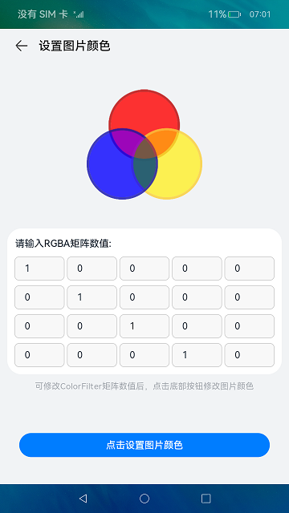
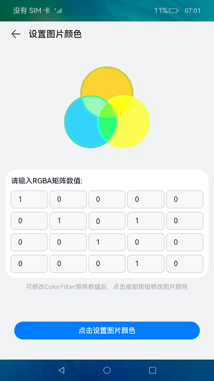
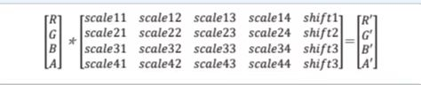

# ColorFilter
### 简介
本示例介绍了常用组件Image的colorFilter属性，通过设置ColorFilter对象构造参数的数组（4*5矩阵）修改图片的显示颜色，效果图如下：   

### 相关概念
计算机系统中的图片资源通常以二进制的形式读取、保存、传输及展示。当图片资源在显示器、显示屏上展示的时候，计算机系统将图片的二进制
数据转换为可以被展示的RGBA格式，为了支持修改Image的图片颜色，需要将图片资源的二进制数据以RGBA的形式读取到计算机系统中，然后将要转换的
源RGBA颜色与ColorFilter（一个4*5的二维矩阵）相乘得到目标颜色R'G'B'A'，过程以数学公式表示：

### 相关权限
不涉及。

### 使用说明
1.修改四行五列矩阵的输入框值；    
2.点击底部设置图片颜色按钮，修改目标图片的颜色值。

### 限制与约束
1.本示例支持API9及以上的标准系统上运行。  
2.本示例支持的SDK版本和DevEco Studio版本：   
SDK版本：3.2.6.5 Beta2及以上。   
DevEco Studio版本：DevEco Studio 3.1 Canary1及以上