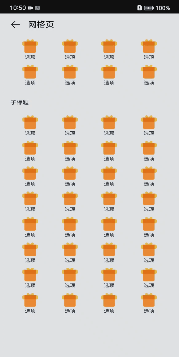

# GridSample
### 简介
本示例介绍了Grid组件的使用，Grid是比较常用的组件，Grid是实现宫格布局的首选! Grid的用法很多,主要凸显的是网格式布局，既有横向也有纵向的数据显示。效果图如下：  



### 相关概念

Grid组件提供了宫格布局的能力，设置columnsTemplate（布局列数），Grid组件会自动根据提供的数据数量和布局列数计算显示行数。


```
columnsTemplate：设置当前网格布局列的数量，不设置时默认1列。

例如, '1fr 1fr 2fr' 是将父组件分3列，将父组件允许的宽分为4等份，第一列占1份，第二列占1份，第三列占2份。并支持auto-fill。

默认值：'1fr'
```


### 相关权限
不涉及

### 使用说明

1.此页面在大屏设备上为静态页面，无用户交互，在小屏设备和手机横屏上可以上下滑动。

### 限制和约束

1.本示例支持API 9及以上的标准系统上运行。

2.本示例支持的SDK版本和DevEco Studio版本：
SDK：3.2.1.4 Canary1及以上。
DevEco Studio版本： DevEco Studio Beta4(Build Version: 3.1.0.100, build on November 3, 2022)及以上。