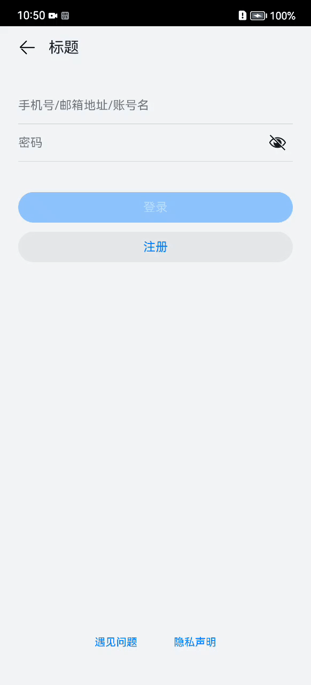

## LoginSample
### 简介
本示例模拟应用登录功能，包含用户名和密码两个输入框，登录注册两个按钮，遇见问题和隐私声明入口，效果图如下：  

### 相关概念
无。

### 相关权限
不涉及。

### 使用说明
1.账号和密码输入框有输入后，登录按钮才可点击，开发者可按需求开发登录按钮可点击逻辑；    
2.点击登录按钮跳转到登录成功页面，开发者可修改成功页面；    
3.点击注册按钮跳转到注册页面，开发者可在该页面开发注册功能；   
4.点击遇见问题跳转到联系客服页面，开发者可修改该页面显示的内容；    
5.点击隐私声明跳转到隐私页面，该页面用web组件加载rawfile下的html资源文件，开发者可修改该html文件； 

## 约束与限制
1、本示例支持API9及以上的标准系统上运行。  
2、本示例支持SDK版本和DecEco Studio版本：  
SDK：3.2.1.4 Canary1及以上。
DevEco Studio版本： DevEco Studio Beta4(Build Version: 3.1.0.100, build on November 3, 2022)及以上。